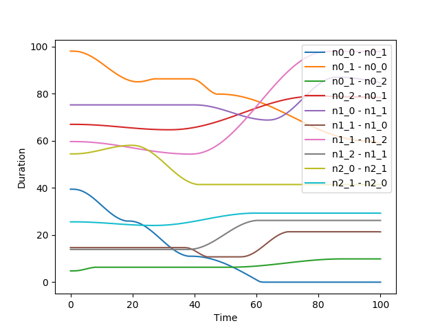

# Traveler

Traveler is a graph-based non-stationary environment simulating travels between waypoints. Each node of the graph represents a location and each edge a route between locations. The travel duration corresponding to an edge is time-dependent, making the environment non-stationary. The goal of an agent is to reach a unique termination node as quickly as possible.

# Use

The code is written in C++ and uses a few non-standard libraries (see Dependencies Section below).
To compile the code, use `make compile`.
To run the code, use `make run`.

The default configuration file is locoated at `config/parameters.cfg`. In order to run the code with a different configuration file, use the command `make run CFGPATH=mypath` replacing `mypath` with your actual path.

# Auto-generated graphs

A feature of the code is to automatically generate the environment's graph. The details are provided in the configuration file. There exist three kinds of graphs:

- Connected directed graph: a fully connected graph with different durations associated to an edge along its two directions. Dead-end are possible.

- Connected symmetric directed graph: a fully connected graph with different durations associated to an edge along its two directions. Dead-end are not possible because the graph is symmetric, meaning that each edge is bi-directional.

- Sequential graph: a hand-made graph composed with a certain number of links (sequence of nodes) between the starting and the ending node. From any node of a link, the agent has the possibility to jump to another node via edges connecting the links together.

For each kind of graph, the way the durations evolve through time can be generated using four different samplers:

- 1st order random uniform;
- 2nd order random uniform;
- 2nd order epsilon-random uniform;
- Cos heuristic: cosinus-like increasing and decreasing for random periods of time.

Here is an illustration of the durations vs time generated by the "Cos heuristic" sampler:

	

# Dependencies

Non-standard libraries used:
- 'libconfig.h++' available at https://github.com/hyperrealm/libconfig
- 'Eigen/Dense' available at http://eigen.tuxfamily.org/

